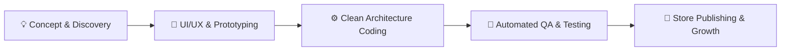

<div align="center">

  <!-- TOP GRADIENT BANNER -->
  <a href="https://akp991892-portfolio.web.app" target="_blank">
    
  </a>

  <!-- DYNAMIC TYPING SVG -->
  <p align="center">
    <a href="https://readme-typing-svg.herokuapp.com">
      
    </a>
  </p>

  <!-- LIVE AVAILABILITY STATUS BADGE -->
  <p align="center">
    
    
    
  </p>

  <!-- HIRE ME DIRECT ACTION BUTTONS -->
  <p align="center">
    <a href="https://www.fiverr.com/akashpandey318" target="_blank">
      
    </a>
    &nbsp;
    <a href="https://www.upwork.com/freelancers/~01e0a297e6e580e0c0" target="_blank">
      
    </a>
    &nbsp;
    <a href="https://akp991892-portfolio.web.app" target="_blank">
      
    </a>
    &nbsp;
    <a href="mailto:akp991892@gmail.com">
      
    </a>
  </p>

  <p align="center">
    <i>Turn your mobile app idea into a sleek, venture-scale product. From wireframes to Apple App Store & Google Play publishing.</i>
  </p>

</div>

---

## 🎯 Why Founders & Companies Choose Me For Mobile Apps

<table>
  <tr>
    <td width="50%">
      <h3>🚀 1. Lightning-Fast 60fps Native Performance</h3>
      <p>I build cross-platform apps using <b>Flutter & Dart</b> that deliver true native speed, buttery 60 FPS animations, and instant gesture responses on both <b>iOS & Android</b>.</p>
    </td>
    <td width="50%">
      <h3>💎 2. Pixel-Perfect UI/UX (Figma to Code)</h3>
      <p>I transform complex Figma, Adobe XD, and Sketch designs into breathtaking, responsive interfaces with dark/light themes, micro-interactions, and Material 3 design standards.</p>
    </td>
  </tr>
  <tr>
    <td width="50%">
      <h3>🛡️ 3. Enterprise Clean Architecture</h3>
      <p>No messy spaghetti code. Every project uses <b>Riverpod 2.x / BLoC</b> with modular feature-first architecture, automated tests, and offline-first data caching.</p>
    </td>
    <td width="50%">
      <h3>🤖 4. Modern AI & LLM Copilot Superpowers</h3>
      <p>Supercharge your app with Generative AI (GPT-4o, Claude 3.5, Gemini Pro), intelligent conversational chat, Vector RAG search, and automated background agents.</p>
    </td>
  </tr>
  <tr>
    <td width="50%">
      <h3>🌐 5. Rock-Solid Backend & API Integration</h3>
      <p>Expert integration with REST APIs, GraphQL, WebSockets, Dio interceptors with automatic JWT token refresh, Firebase, Supabase, and Cloud Functions.</p>
    </td>
    <td width="50%">
      <h3>📦 6. 100% App Store & Play Store Approval</h3>
      <p>I manage the entire release pipeline: provisioning profiles, app icons, splash screens, privacy manifests, store metadata, and submission support.</p>
    </td>
  </tr>
</table>

---

## 💼 Comprehensive Mobile Development Services



| 📱 Service | 🔍 What You Get | ⏱️ Turnaround |
| :--- | :--- | :--- |
| **Complete MVP App (iOS + Android)** | End-to-end mobile application from scratch with state management, authentication, database & API sync. | **2 - 4 Weeks** |
| **AI-Powered Mobile Application** | Custom AI chat assistants, streaming LLM responses, Vector RAG document search, image generation integration. | **1 - 3 Weeks** |
| **Figma / Adobe XD to Flutter Code** | 100% pixel-perfect responsive Flutter implementation with custom animations and interactive widgets. | **3 - 7 Days** |
| **API & Cloud Backend Integration** | Connect your frontend with Firebase / Supabase / Node.js / Python REST APIs, payment gateways (Stripe, Razorpay). | **3 - 5 Days** |
| **Bug Fixing, Speed & Performance Audit** | Fix memory leaks, laggy scroll lists, outdated packages, crashes, and optimize battery/network usage. | **24 - 48 Hours** |

---

## 🏆 Featured Live Projects & Client Showcases

<div align="center">

<table>
  <!-- PROJECT 1 & 2 -->
  <tr>
    <td width="50%" valign="top">
      <div align="center">
        <h3>🤖 Handshake Platform — AI Copilot & RAG</h3>
        <p><b>Enterprise Multi-Agent AI Mobile & Web Workspace</b></p>
      </div>
      <ul>
        <li>⚡ Real-time token streaming with <b>GPT-4o, Claude 3.5 & Gemini 1.5 Pro</b>.</li>
        <li>⚡ Vector RAG semantic search powered by <b>Pinecone</b>.</li>
        <li>⚡ Multi-agent automated candidate matching & resume intelligence.</li>
      </ul>
      <p align="center">
        <a href="https://github.com/AKASH80047/Portfolio">
          
        </a>
      </p>
    </td>
    <td width="50%" valign="top">
      <div align="center">
        <h3>🎵 Feel Every Beat — Audio Streaming App</h3>
        <p><b>Production-Grade Music & Podcast Platform</b></p>
      </div>
      <ul>
        <li>⚡ Background audio playback & lock-screen media controls.</li>
        <li>⚡ <b>JustAudio + AudioService + Riverpod</b> state orchestration.</li>
        <li>⚡ Offline audio caching, waveform visualizers & playlist management.</li>
      </ul>
      <p align="center">
        <a href="https://github.com/AKASH80047/Feel-Every-Beat-">
          
        </a>
      </p>
    </td>
  </tr>

  <!-- PROJECT 3 & 4 -->
  <tr>
    <td width="50%" valign="top">
      <div align="center">
        <h3>🛍️ AppleCart — Modern E-Commerce Suite</h3>
        <p><b>Full-Featured Mobile Shopping Experience</b></p>
      </div>
      <ul>
        <li>⚡ Dynamic product catalog, search filters, and persistent cart.</li>
        <li>⚡ Secure checkout, coupon codes, and order tracking.</li>
        <li>⚡ BLoC pattern + Dio REST interceptors with token refresh.</li>
      </ul>
      <p align="center">
        <a href="https://github.com/AKASH80047/AppleCart">
          
        </a>
      </p>
    </td>
    <td width="50%" valign="top">
      <div align="center">
        <h3>💰 Expense Tracker — Personal Finance App</h3>
        <p><b>Budgeting & Financial Analytics Suite</b></p>
      </div>
      <ul>
        <li>⚡ Daily transaction ledgers with real-time budget warnings.</li>
        <li>⚡ Interactive visual breakdown charts & monthly turnover analytics.</li>
        <li>⚡ Offline-first data synchronization with Firebase Cloud.</li>
      </ul>
      <p align="center">
        <a href="https://expense-tracker-81bcf.web.app" target="_blank">
          
        </a>
      </p>
    </td>
  </tr>

  <!-- PROJECT 5 & 6 -->
  <tr>
    <td width="50%" valign="top">
      <div align="center">
        <h3>📝 Online Examination & Quiz Portal</h3>
        <p><b>Multi-Role Timed Testing Engine</b></p>
      </div>
      <ul>
        <li>⚡ Automated countdown timer with anti-cheating window blur detector.</li>
        <li>⚡ Instant score calculation and detailed analytics breakdown.</li>
        <li>⚡ Multi-tier role permissions (Admin, Teacher, Student).</li>
      </ul>
      <p align="center">
        <a href="https://github.com/AKASH80047/Online-Exam-Portal">
          
        </a>
      </p>
    </td>
    <td width="50%" valign="top">
      <div align="center">
        <h3>🌐 Akash Pandey — Personal Web Portfolio</h3>
        <p><b>Interactive Flutter Web Showcase</b></p>
      </div>
      <ul>
        <li>⚡ Responsive layouts across Desktop, Tablet, and Mobile screens.</li>
        <li>⚡ Interactive project cards, skills matrix, and direct contact portal.</li>
        <li>⚡ High-speed asset caching on Firebase Hosting.</li>
      </ul>
      <p align="center">
        <a href="https://akp991892-portfolio.web.app" target="_blank">
          
        </a>
      </p>
    </td>
  </tr>
</table>

</div>

---

## 🛠️ Complete Technical Arsenal & Toolkit

<div align="center">

### 📱 Mobile Frameworks & Core Languages
<p>
  
  
  
  
  
  
  
</p>

### ⚙️ State Management & Architecture
<p>
  
  
  
  
  
</p>

### 🤖 Generative AI, LLMs & Vector Search
<p>
  
  
  
  
  
</p>

### ☁️ Cloud, APIs & Database
<p>
  
  
  
  
  
  
</p>

### 🛠️ Developer Tools & DevOps
<p>
  
  
  
  
  
  
  
</p>

</div>

---

## 🤝 How We Will Work Together (Client Guarantee)

```
1️⃣ Free Discovery & Requirements Scoping (We discuss your goals, features, and timeline)
2️⃣ Interactive UI/UX Wireframing & Tech Stack Architecture
3️⃣ Agile Sprint Development (Regular testable APK & TestFlight builds sent to you)
4️⃣ Strict QA, Performance Optimization & Security Testing
5️⃣ App Store & Google Play Store Submission
6️⃣ 30 Days Free Post-Launch Support & Maintenance
```

> **🛡️ Zero-Risk Guarantee:**
> - **100% Intellectual Property (IP) & Code Ownership** transferred upon completion.
> - **Daily Communication** via Fiverr, Upwork, Slack, or Email with recorded demo videos.
> - **Milestone-Based Escrow Payments** — you only release funds when you are 100% satisfied with the deliverables.

---

## 📊 Live GitHub Statistics & Activity

<div align="center">
  <table border="0">
    <tr>
      <td align="center">
        
      </td>
      <td align="center">
        
      </td>
    </tr>
    <tr>
      <td colspan="2" align="center">
        
      </td>
    </tr>
  </table>
</div>

---

## 🚀 Ready to Launch Your Next Million-Dollar App?

Whether you need a full app developed from scratch, an existing codebase rewritten for speed, or an intelligent AI agent integrated into your product — **I'm ready to turn your vision into reality.**

<div align="center">

<br/>

[](https://www.fiverr.com/akashpandey318)
&nbsp;
[](https://www.upwork.com/freelancers/~01e0a297e6e580e0c0)
&nbsp;
[](https://akp991892-portfolio.web.app)

<br/>

[](https://www.linkedin.com/in/akash-pandey-53b7b4272)
&nbsp;
[](mailto:akp991892@gmail.com)

<br/>

```
⭐⭐⭐⭐⭐ "Building high-performance mobile applications that users love and businesses scale on."
```


</div>
